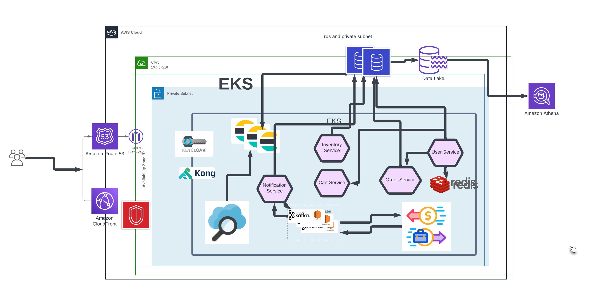

# Part: A - Develop & Deploy a REST API

## I used github actions for ci/cd.

## eks for container orcestation.

## I optimised the docker file (installed )

fyi: I couldnt manage to modulirazed the terraform code, as i do not use terraform yet professionally. But i understand modulirised terraform code. I tried few issues, And for shortage of time I decided to go with current implementation.

# Api end point for depo app: http://af64417d66c9948b7884c0b5c6f5db87-1355228082.ap-south-1.elb.amazonaws.com/

# Please check this url for better view: https://lucid.app/lucidchart/5e65cb0b-e4b0-498e-a3aa-a35e5467225b/edit?viewport_loc=-1627%2C-270%2C3202%2C1665%2C0_0&invitationId=inv_eff8b022-ddcc-4f08-b010-4c8ba342738d

# Part: B – System Architecture

In my daily life, I am not dedicatedly involved in software architecture, but I have actively participated in architecting while being a part of dynamic teams.

# Assumption

Assuming we have a monolithic e-commerce website, the goal is to make it globally available with a focus on cost optimization.

# Proposed Plan

I planning to leverage AWS globalization and split services into microservices. The architecture will utilize a combination of open source and managed AWS resources:

1. **EKS for Container Orchestration**

   - Utilize EKS with node auto-scaling for container orchestration.

2. **RDS for Database**

   - Use RDS for database management.

3. **Kong as API Gateway**

   - Employ Kong for API gateway functionalities and security.

4. **Keycloak for Identity Server and SSO**

   - Implement Keycloak for identity management and single sign-on.

5. **Elasticsearch**

   - Deploy the community version on EKS for product searching and application log storage.

6. **External NFS Server in EKS for Stateful Set Storage**

   - Use an external NFS server for storage of stateful sets in EKS.

7. **Kafka for Queuing Service**

   - Utilize Kafka for queuing services, especially for notification tasks such as payments, mailing, and messaging.

8. **CloudFront for Static Data Caching**

   - Implement CloudFront for caching static data.

9. **Kubernetes Cron Jobs**

   - Use Kubernetes Cron Jobs for scheduled tasks like product fetching and analysis.

10. **Self-deployed Redis Cluster**

    - Deploy a self-managed Redis cluster for frequently accessed user information.

11. **AWS Route 53 for Load Balancing**

    - Implement AWS Route 53 for region-based load balancing.

12. **Security Measures**

    - Utilize AWS Shield, WAF, and other security appliances for application security and DDoS attack resistance.

13. **Monitoring**

    - Use CloudWatch for monitoring EKS nodes and DB nodes, and Kibana for application logs and traces.

14. **Additional Monitoring with Grafana**

    - Optionally, integrate Grafana for additional monitoring and metrics.

15. **For dashboard queries**
    - Aws datalake is very costlier and we can use anthena for doing long quering for analytical data. But I am still looking for costoptimised services to this.

FYI: I have worked for few big system like `https://eicher.in/` and `https://drinkprime.in/` . And am still working as devops for them. (they are indian(hydrabad)) software company. I work for them part time and task basis. I also experiences 400 milions transactions per month for eicher. We are working with ibm cloud for eicher srm ,cdm and amdc.
